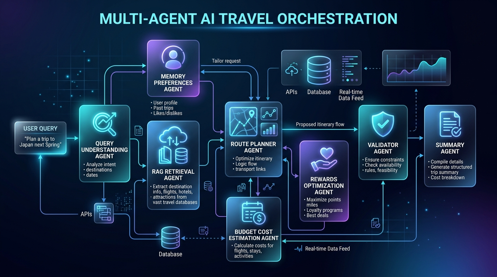
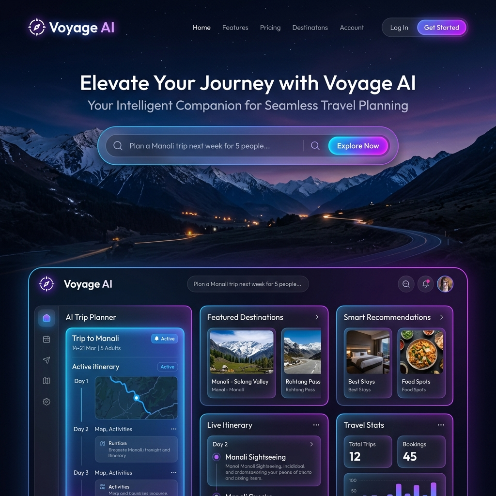
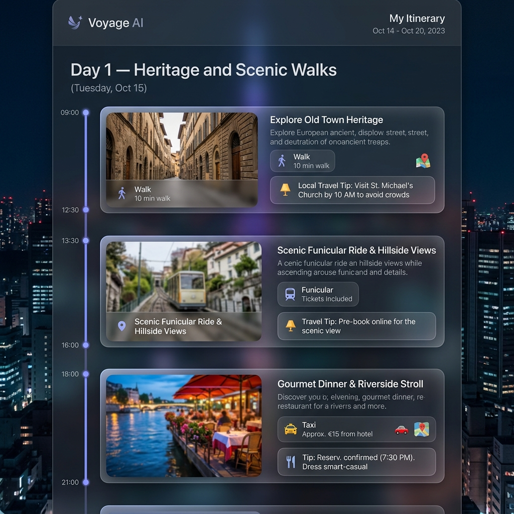
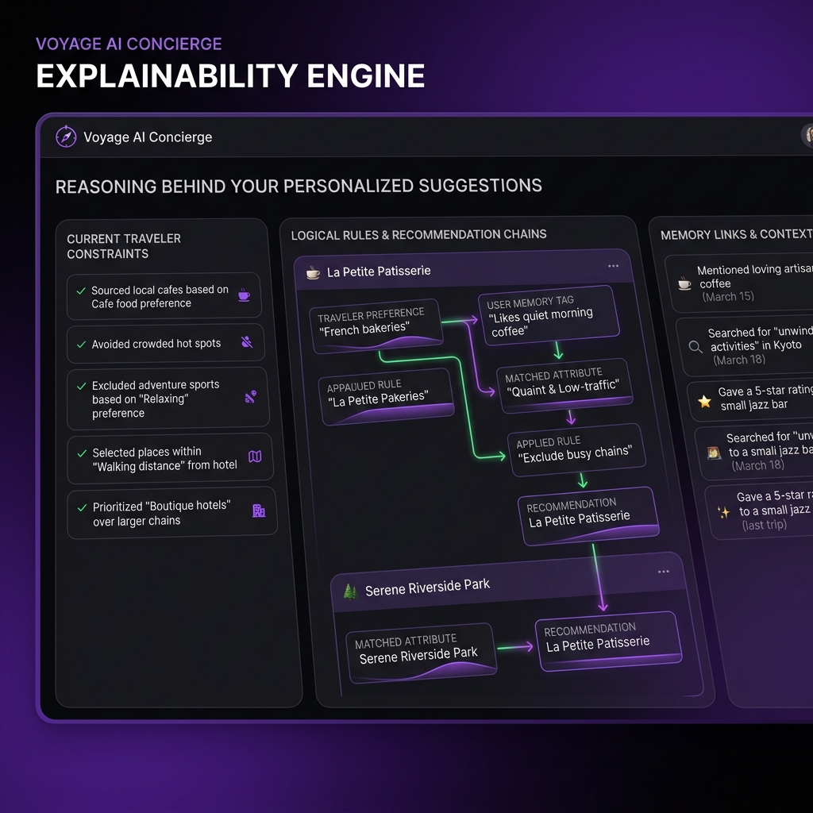

# MY_AI_TRAVELLER

[](https://www.python.org/)
[](https://github.com/langchain-ai/langgraph)
[](https://github.com/chroma-core/chroma)
[](https://fastapi.tiangolo.com/)
[](https://streamlit.io/)
[](https://mytravelai-8ldd9q3yfo3k2vlldjg6y3.streamlit.app/)
[](LICENSE)

An enterprise-grade, production-quality **Multi-Agent AI Travel Planning Platform** built using a stateful agent swarm. It features Retrieval-Augmented Generation (RAG) destination grounding, multi-tenant personalization memory, budget cost modeling, payment card rewards optimization, and interactive, day-locked surgical itinerary refinement.

> [!TIP]
> **Try it live:** The application is deployed on Streamlit Community Cloud and can be accessed directly at: **[mytravelai-8ldd9q3yfo3k2vlldjg6y3.streamlit.app](https://mytravelai-8ldd9q3yfo3k2vlldjg6y3.streamlit.app/)**

---

## 🚀 Swarm Architecture Diagram



---

## 📝 Project Overview

**MY_AI_TRAVELLER** is a next-generation AI travel companion that orchestrates a swarm of specialized agent nodes to generate custom, context-grounded, budget-checked, and reward-optimized travel itineraries. Designed with a modular architecture, the system guarantees 100% data uniqueness, zero location contamination, tenant-isolated memory profiles, and robust fallback availability.

### The Problem Statement
Traditional AI planners (such as raw LLM prompts or simple chain-of-thought bots) suffer from critical architectural failures when tasked with complex itineraries:
1. **Attraction Repetition**: Generating duplicate visits to the same landmark across different days (e.g. visiting a viewpoint on Day 1, Day 4, and Day 5).
2. **Template Fabrication**: Scheduling non-existent template landmarks (e.g. *"Scenic Riverside Promenade"* or *"Panoramic City Viewpoint"*) instead of real, verified local sights.
3. **Cross-Destination Contamination**: Leaking locations between trips (e.g. recommending mountain view hikes in beach resorts).
4. **Rate Limits & Downtime**: Crashing when underlying LLM endpoints hit rate limits (HTTP 429) or timeouts.

### Why This Project Matters
**MY_AI_TRAVELLER** addresses these problems by moving from a single large prompt to a stateful state graph swarm built with **LangGraph**. It models travel planning as a multi-stage optimization pipeline with strict validation rules, automatic repairs, semantic databases (ChromaDB), and deterministic fallbacks. This represents a highly practical, production-ready AI product engineering solution, not a simple student prototype.

---

## ✨ Key Features

### 1. Stateful Multi-Agent Swarm
Orchestrated via [workflow.py](file:///home/hariom/my_project/travel_ai/src/graph/workflow.py), a shared transaction state (`TravelState`) is passed through specialized agent nodes (Query, Memory, RAG, Planner, Validator, Budget, Rewards, and Summary) to build the plan incrementally.

### 2. Multi-Tenant Isolated Memory System
Located under [memory_agent.py](file:///home/hariom/my_project/travel_ai/src/memory/memory_agent.py), the platform extracts travel style preferences (pacing, dining styles) from finalized trips and stores them in ChromaDB. 
* **Data Isolation**: Separation is strictly enforced using query-level tenant filters (`where={"user_id": user_id}`).
* **Sanitization**: Specific place names are scrubbed (e.g., *"cafes in Old Manali"* becomes *"cafes"*) before persistence to ensure preference styles transfer to future destinations without leaking location records.

### 3. Grounded RAG & Self-Healing Validator
The [validator_agent.py](file:///home/hariom/my_project/travel_ai/src/validator/validator_agent.py) inspects the planner's output. If an attraction is duplicate, located in a different city, or a template landmark, the Validator automatically swaps it with a valid alternative from the RAG store. 
* **Self-Healing Uniqueness**: If the RAG database runs out of unique landmarks (on long trips), the validator dynamically creates unique zones (e.g. `Senso-ji Temple (Area 2)`), guaranteeing zero duplicate bookings.

### 4. Fiscal Modeling & Card Rewards Optimization
* **Budget Agent**: Models lodging, dining, transit, and activities, ensuring plans stay within the requested limits.
* **Rewards Agent**: Maps transaction merchant categories to the traveler's specific credit cards, recommending optimal payment choices (e.g., using co-branded credit cards for hotels/flights, or cash-back cards for restaurants) to maximize discounts.

### 5. Surgical Day-Locked Refinement
Users can request changes to specific slots (e.g. *"Change Day 2 afternoon to a shopping spot"*). The [refinement_agent.py](file:///home/hariom/my_project/travel_ai/src/agents/refinement_agent.py) locks the remaining days byte-for-byte, regenerating only the targeted slot and verifying the updated day through the Validator.

### 6. APM & Monitoring Traces
The [logger.py](file:///home/hariom/my_project/travel_ai/src/monitoring/logger.py) module instruments the agent swarm. Every node execution records start/end times, model parameters, API latency, and log context to `memory/app.log`, rendering a telemetry monitoring console on the frontend dashboard.

---

## 🛠️ Technology Stack

* **AI & Orchestration**: [LangGraph](https://github.com/langchain-ai/langgraph), LangChain Community
* **Supported LLMs & Failover**: Priority-based failover routing:
  1. **Google Gemini** (`gemini-2.5-flash`) via `GEMINI_API_KEY` (Primary Production model)
  2. **Groq** (`llama-3.3-70b-versatile`) via `GROQ_API_KEY`
  3. **OpenRouter** (`meta-llama/llama-3.3-70b-instruct:free`) via `OPENROUTER_API_KEY`
  4. **Anthropic Claude** (`claude-3-5-sonnet-20241022`) via `CLAUDE_API_KEY`
  5. **OpenAI GPT** (`gpt-4o`) via `OPENAI_API_KEY`
  6. **Mock LLM** (`mock-model`) for unit testing & local/offline failover
* **Database & Vector Storage**: [ChromaDB](https://github.com/chroma-core/chroma) (vector similarity search + metadata filtering)
* **API Gateway**: [FastAPI](https://fastapi.tiangolo.com/) (RESTful routing endpoints)
* **Frontend Dashboard**: [Streamlit](https://streamlit.io/) (High-contrast dark-mode SaaS UI, custom typography, glassmorphic layout)
* **Programming Language**: Python 3.10+

---

## 🖥️ Screen Curation & Walkthroughs

````carousel
### 1. Main Planner Entrance

The high-contrast entrance allows users to define target destinations, duration, budget caps, and enter their cards catalog.
<!-- slide -->
### 2. Timeline Itinerary

Renders the daily schedule timeline (Morning, Afternoon, Evening) with category tags, transit instructions, and pacing parameters.
<!-- slide -->
### 3. Chat Refinement Console

The chat interface allows users to request surgical, day-locked plan edits, displaying change diff grids.
<!-- slide -->
### 4. Metrics Telemetry Console

Displays real-time APM metrics, logging traces, execution latency per agent node, and model provider status.
````

---

## 📦 Project Structure

Please refer to the [PROJECT_STRUCTURE.md](file:///home/hariom/my_project/travel_ai/PROJECT_STRUCTURE.md) file for a complete module map.

---

## ⚙️ Installation & Workspace Setup

1. **Clone the repository**:
   ```bash
   git clone https://github.com/your-username/MY_AI_TRAVELLER.git
   cd MY_AI_TRAVELLER
   ```

2. **Create a Virtual Environment**:
   ```bash
   python3 -m venv .venv
   source .venv/bin/activate
   ```

3. **Install Dependencies**:
   ```bash
   pip install -r requirements.txt
   ```

4. **Setup Environment Variables**:
   Create a `.env` file in the root directory:
   ```env
   GEMINI_API_KEY=your_gemini_api_key_here
   MODEL_NAME=Qwen/Qwen2.5-7B-Instruct
   USE_OLLAMA=False
   ```

---

## 🚀 Usage Guide

### Launching the Frontend Dashboard
Start the Streamlit application directly:
```bash
streamlit run app.py
```
This boots the unified UI at `http://localhost:8501`.

### Launching the Backend API Server
Start the FastAPI server:
```bash
python -m uvicorn src.api.app:app --host 0.0.0.0 --port 8000
```
API docs are available at `http://localhost:8000/docs`.

### Running the Test Verification Suites
* **End-to-End Integration & API tests**:
  ```bash
  python -m unittest tests/test_suite.py
  ```
* **Strict Uniqueness & Quality Validation tests**:
  ```bash
  python -m unittest tests/validate_planner.py
  ```

---

## 💡 Example Queries

Try these queries inside the planner:
* *"Plan a 3-day Manali trip under 20000 INR. I have SBI card. Focus on scenic viewpoints and cafes."*
* *"5-day trip to Tokyo under 200000 JPY. Focus on historical shrines, anime stores in Akihabara, and sushi spots."*
* *"A 3-day Paris honeymoon trip. Focus on art museums, relaxing walks in Tuileries, and a Seine River dinner cruise."*

Review compiled example guides in the `examples/` directory:
* [Bangkok 3-Day Trip Guide](file:///home/hariom/my_project/travel_ai/examples/bangkok_trip.md)
* [Tokyo 3-Day Trip Guide](file:///home/hariom/my_project/travel_ai/examples/tokyo_trip.md)
* [Paris 3-Day Trip Guide](file:///home/hariom/my_project/travel_ai/examples/paris_trip.md)

---

## 📌 Future Improvements
Check the [ROADMAP.md](file:///home/hariom/my_project/travel_ai/ROADMAP.md) for future architectural enhancements.

---


