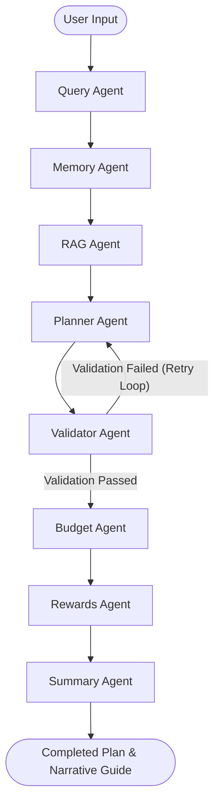

# MY_AI_TRAVELLER

### Enterprise Multi-Agent AI Travel Planning Swarm

[](https://www.python.org/)
[](https://github.com/langchain-ai/langgraph)
[](https://github.com/chroma-core/chroma)
[](https://fastapi.tiangolo.com/)
[](https://streamlit.io/)
[](https://mytravelai-8ldd9q3yfo3k2vlldjg6y3.streamlit.app/)
[](LICENSE)

An enterprise-grade, production-quality **Multi-Agent AI Travel Planning Swarm** built to deliver robust, authentic, and highly personalized travel itineraries. The system orchestrates a swarm of specialized agent nodes utilizing stateful transactions, Retrieval-Augmented Generation (RAG) destination grounding, tenant-isolated memory profiles, budget cost modeling, payment card rewards optimization, and surgical day-locked edits.

> [!TIP]
> **Try the Live App:** The platform is deployed on Streamlit Community Cloud and can be accessed directly at: **[mytravelai-8ldd9q3yfo3k2vlldjg6y3.streamlit.app](https://mytravelai-8ldd9q3yfo3k2vlldjg6y3.streamlit.app/)**

---

## 🚀 Swarm Architecture Diagram

The swarm architecture guarantees high cohesion and decoupled execution. The shared state is built incrementally as the transaction passes through specialized functional boundaries.


---

## 📝 Project Overview

**MY_AI_TRAVELLER** is a next-generation AI travel companion designed as a stateful agent swarm. Instead of relying on a single complex prompt or basic sequence chains, this project utilizes **LangGraph** to model travel planning as a multi-stage optimization pipeline. The system enforces strict validations, self-healing repairs, and deterministic fallbacks.

### The Problems Solved:
1. **Attraction Repetition:** Automatically detects and prevents duplicate visits to the same landmark across different days (e.g. visiting a beach on Day 1 and repeating it on Day 3).
2. **Template Fabrication:** Eliminates fake or hallucinated landmarks (e.g. *"Scenic Viewpoint"* or *"Botanical Garden Lanes"*) by grounding the planner in a verified local RAG database.
3. **Cross-Destination Contamination:** Uses strict destination isolation to prevent location leakage (e.g. recommending landmarks from Jaipur on a trip to Manali).
4. **Rate Limits & Downtime:** Implements robust client-side retry engines with exponential backoff to handle HTTP 429 rate limit exceptions, alongside pre-registered local fallback registries for 100% uptime.

---

## ✨ Key Features

* **Stateful Multi-Agent Swarm:** Orchestrates agent execution using a shared transaction state (`TravelState`) flowing through Query, Memory, RAG, Planner, Validator, Budget, Rewards, and Summary agent nodes.
* **Any Destination Worldwide Support:** Leverages global LLM knowledge base with fallback protection to schedule authentic landmarks globally.
* **Personalized User Memory:** Learns user travel styles (pacing, dining preferences) over time and stores them in **ChromaDB** with strict tenant isolation (`where={"user_id": user_id}`). Specific place names are scrubbed to allow styles to transfer cleanly between cities without database contamination.
* **Fiscal Cost Modeling & Budget Validation:** Models accommodation, dining, activities, and transit costs, validating them against the user's budget caps and logging exceptions.
* **Payment Card Rewards Optimizer:** Maps merchant categories to the traveler's active credit cards, offering advice on which card/UPI to swipe to maximize cashback and reward benefits.
* **Surgical Day-Locked Plan Refinements:** Allows users to modify specific slots (e.g. *"Change Day 2 afternoon to a temple"*). The system locks the rest of the plan byte-for-byte, updates only the target slot, and executes validations.
* **Real-Time Telemetry & APM Console:** Traces agent execution time, API call latency, prompt token counts, and logging outputs to `memory/app.log`, rendering a detailed audit grid.
* **Dual-Layer Fallover Engine:** Retries rate-limited API calls dynamically using `RetryInfo` backoffs. If the key is completely exhausted, the app falls back to local database mappings.

---

## 🔄 Multi-Agent Workflow



---

## 🖥️ Screen Curation & Walkthroughs

````carousel
### 1. Main Planner Entrance

Configure user profiles, active credit cards, destination parameters, and enter natural language queries.
<!-- slide -->
### 2. Timeline Itinerary

Renders the narrative daily schedule split into Morning, Afternoon, and Evening slots with cost estimates and local tips.
<!-- slide -->
### 3. Surgical Chat Refinement

Interact with the plan to make day-locked modifications, viewing change diff logs directly on the interface.
<!-- slide -->
### 4. Telemetry & Decision Traces

Check real-time agent execution latency, model providers, explainability logs, and prompt characteristics.
````

---

## 🛠️ Technical Stack

* **Core & Orchestration:** Python 3.11+, LangGraph, LangChain Core
* **Supported LLMs:** Multi-LLM provider failover pipeline:
  1. **Google Gemini Free** (`gemini-2.5-flash-lite`) - Primary
  2. **Groq Free** (`llama-3.3-70b-versatile`)
  3. **OpenRouter Free** (`meta-llama/llama-3.3-70b-instruct:free`)
  4. **Google Gemini Backup** (`gemini-2.5-flash-lite`)
  5. **Groq Backup** (`llama-3.3-70b-versatile`)
  6. **OpenRouter Backup** (`meta-llama/llama-3.3-70b-instruct:free`)
* **Vector Database:** ChromaDB
* **API Framework:** FastAPI, Uvicorn
* **Frontend Dashboard:** Streamlit (Custom high-contrast dark-mode theme, glassmorphic card layouts, and local typography)

---

## ⚙️ Installation & Setup

### Prerequisites
Ensure you have Python 3.11+ installed.

### Linux & MacOS
1. Clone the repository:
   ```bash
   git clone https://github.com/Hariom312003/my_travel_AI.git
   cd my_travel_AI
   ```
2. Initialize and set up virtual environments and ingest data:
   ```bash
   chmod +x setup.sh
   ./setup.sh
   ```
   *(This automatically creates `.venv`, updates pip, installs dependencies, and pre-populates ChromaDB)*.

### Windows
1. Clone the repository:
   ```cmd
   git clone https://github.com/Hariom312003/my_travel_AI.git
   cd my_travel_AI
   ```
2. Set up virtual environment and install packages:
   ```cmd
   python -m venv .venv
   .venv\Scripts\activate
   pip install -r requirements.txt
   ```
3. Pre-ingest RAG travel database:
   ```cmd
   set PYTHONPATH=src
   python -c "from rag.rag_agent import ingest_travel_data; ingest_travel_data()"
   ```

### Docker
Build and run the entire platform concurrently:
```bash
docker-compose up --build
```

---

## 🔑 Environment Variables

Create a `.env` file in the root directory:
```env
# Primary LLM API Keys
GEMINI_API_KEY=your_gemini_api_key_here
GROQ_API_KEY=your_groq_api_key_here
OPENROUTER_API_KEY=your_openrouter_api_key_here

# Backup LLM API Keys (For SRE failover resilience)
GEMINI_API_KEY_BACKUP=your_backup_gemini_key_here
GROQ_API_KEY_BACKUP=your_backup_groq_key_here
OPENROUTER_API_KEY_BACKUP=your_backup_openrouter_key_here

# Configurations
ENVIRONMENT=production
MODEL_NAME=Qwen/Qwen2.5-7B-Instruct
```

---

## 🚀 Running Locally

### Start Both Backend & Frontend Concurrently (Fastest way)
Execute the startup helper script:
```bash
chmod +x run.sh
./run.sh
```
This boots the FastAPI backend at `http://localhost:8000` and the Streamlit UI dashboard at `http://localhost:8501`.

### Manual Startup (Individual components)
* **Start Backend API:**
  ```bash
  uvicorn src.api.app:app --host 0.0.0.0 --port 8000 --reload
  ```
* **Start Streamlit Dashboard:**
  ```bash
  streamlit run app.py --server.port 8501 --server.address 0.0.0.0
  ```

### Run Test Verification Suites
* **API & Integration Tests:**
  ```bash
  python -m unittest tests/test_suite.py
  ```
* **Uniqueness & Quality Validation Tests:**
  ```bash
  python -m unittest tests/validate_planner.py
  ```

---

## 💡 Example Queries

Type these sample requests into the sandbox query box:
* *"Plan a 3-day trip to Goa. I want to visit local beaches, Chapora Fort, and sample Goan seafood. Have SBI card."*
* *"5-day trip to Tokyo. Focus on historical shrines, anime stores in Akihabara, and sushi spots. Pacing should be slow."*
* *"A 3-day Paris honeymoon trip. Focus on art museums, relaxing walks in Tuileries, and a Seine River dinner cruise."*
* *"Plan a 5-day family vacation to Singapore under 150000 INR."*

---

## Copyright

Copyright © 2026 Hariom Gupta

All Rights Reserved.

This repository was developed by Hariom Gupta as part of advanced work in AI-powered travel planning systems.

The source code, architecture, workflows, documentation, diagrams, and project assets are the intellectual work of Hariom Gupta unless otherwise stated.

Permission is granted according to the repository license.

For commercial usage, redistribution, collaboration requests, or partnership inquiries, please contact the repository owner.

---

## Author

**Hariom Gupta**  
AI Engineer | Data Engineer | Machine Learning Enthusiast  

* **GitHub:** [Hariom312003](https://github.com/Hariom312003)
* **LinkedIn:** [LinkedIn Profile](https://www.linkedin.com/in/hariom-gupta-03/)
* **Project:** [MY_AI_TRAVELLER](https://github.com/Hariom312003/my_travel_AI)
