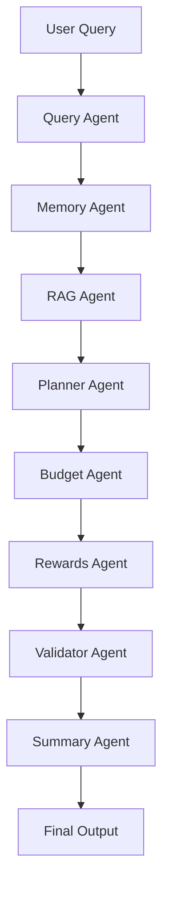
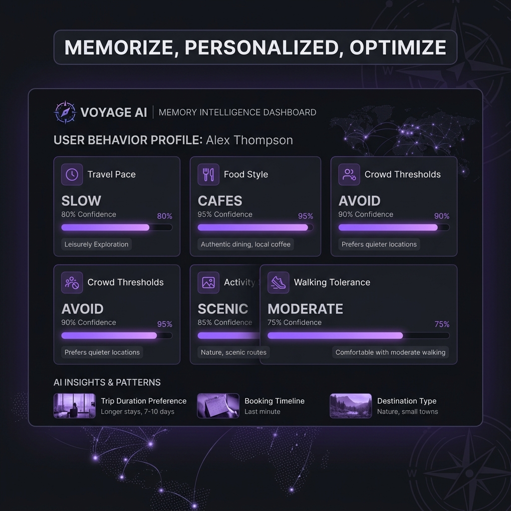
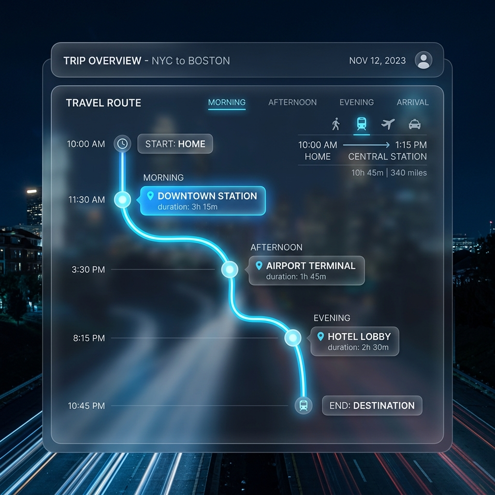
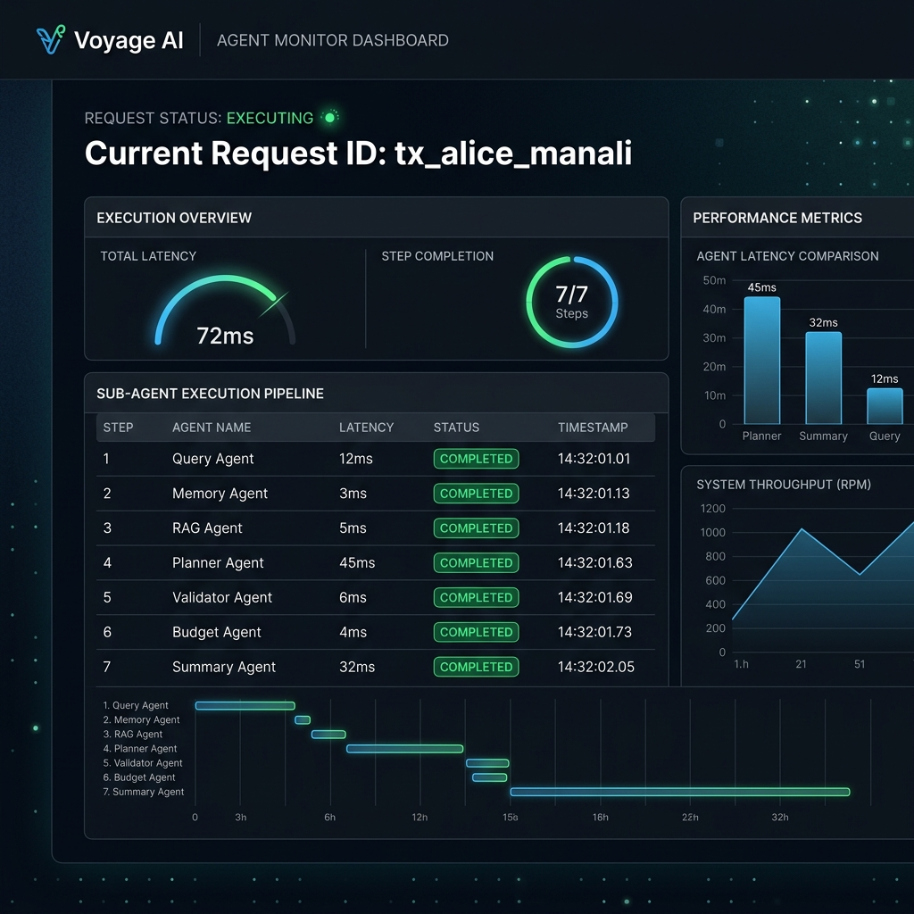

# my_travel_AI

> **AI-Powered Personalized Travel Planning Platform**

`my_travel_AI` is a feature-complete travel planning application. It utilizes a multi-agent orchestrator managed by **LangGraph** to construct personalized itineraries based on budget, credit card rewards, and persistent user preferences, backed by local **ChromaDB** storage and a rigorous rule-validation engine.

---

## 1. Overview
`my_travel_AI` is designed for public open-source showcase. It provides a robust sandbox to test multi-agent itinerary planning. By decoupling query parsing, memory retrieval, RAG, scheduling, budget estimation, rewards optimization, and rule validation into distinct agents, the system guarantees high-quality, constraints-compliant output.

---

## 2. Problem Statement
Standard LLM-based travel planners suffer from three critical problems:
1. **Context Contamination (Cross-Destination Hallucination)**: LLMs mix up sightseeing spots across different cities (e.g., placing Hadimba Temple in Goa).
2. **Volatility of Plans (Full Rewrites)**: When a user asks to modify a single slot in an itinerary, standard planners rewrite the entire plan, breaking unchanged days.
3. **Session Amnesia**: Planners do not remember user style preferences (like walking tolerance, pacing, food styles) across sessions unless manually repeated.

`my_travel_AI` solves these challenges through **rule validation**, **surgical day-locked replanning**, and a **persistent memory system**.

---

## 3. Features (Honesty Classification)

We classify each feature honestly to establish engineering credibility:

| Feature | Classification | Description |
| :--- | :--- | :--- |
| **Preference Extraction & Persistent Memory** | **REAL** | Extracts user preferences (pace, food style, activity type) and stores them in ChromaDB partitions. Sanitizes physical locations to prevent cross-destination leakage. |
| **Surgical Day-Locked Replanning** | **REAL** | Allows editing specific days (e.g., "Change Day 2") while locking others, preserving them byte-for-byte. Supports slot swapping. |
| **Decision Trace & Explainability** | **REAL** | Shows real-time evidence traces (matched preferences, memory query, RAG matches, validation repairs) directly from execution states. |
| **Itinerary Grounding & Rule Validation** | **REAL** | A rule-based post-planner agent that strips out cross-destination locations and duplicate activities, repairing them with valid RAG alternatives. |
| **Route Visualization** | **REAL** | Displays chronological transit path steps with durations and vehicle recommendations. |
| **Budget & Rewards Optimization** | **REAL** | Breaks down lodging, transit, food, and activities, matching them with credit card reward rules. |
| **Map Visualization** | **DEMO IMPLEMENTATION** | Shows route visualization inside Streamlit via high-contrast HTML transit chains instead of live Leaflet/Google Maps API integration. |

---

## 4. Architecture
The system uses a decoupled FastAPI backend and a Streamlit frontend.
* **Streamlit Frontend**: Coordinates demo profiles, refinement inputs, and renders the dashboards.
* **FastAPI Backend**: Exposes endpoints for planning, refinement, finalization, and memory management.
* **LangGraph Swarm**: Orchestrates execution state passing through a sequence of specialized python agents.

---

## 5. Multi-Agent Workflow



1. **Query Agent**: Extracts metadata (days, budget, cards) and target destination.
2. **Memory Agent**: Retrieves style preferences from ChromaDB based on `user_id`.
3. **RAG Agent**: Queries local ChromaDB to pull valid attractions matching the destination and user interests.
4. **Planner Agent**: Schedules activities into Morning, Afternoon, and Evening slots.
5. **Budget Agent**: Computes granular cost breakdowns.
6. **Rewards Agent**: Matches category spend with the user's credit card profile.
7. **Validator Agent**: Audits constraints (hallucinations, leaks, duplicates) and repairs conflicts.
8. **Summary Agent**: Compiles clean, simple, readable travel guides.

---

## 6. Personalized Memory System
When a user submits a query, the **Memory Agent** extracts style preferences:
* **Travel Pace**: Slow, Medium, Fast
* **Food Preference**: Local food, Cafes, Fine dining
* **Activity Style**: Scenic, Culture, Adventure, Shopping
* **Walking Tolerance**: Low, Moderate, High

Preferences are stored in a partition keyed by `user_id` in ChromaDB. Physical destination tags are filtered out to prevent cross-destination pollution when the user plans a trip to a different city in the future.

---

## 7. Surgical Day-Locked Replanning
To prevent full-itinerary rewrites on minor adjustments:
1. The user specifies feedback (e.g., `"Swap Day 1 afternoon with Day 2 evening"`).
2. The **Refinement Agent** parses target days and executes targeted adjustments.
3. Untouched days are locked and remain byte-for-byte identical, guaranteeing plan stability.

---

## 8. Decision Trace & Explainability
Instead of black-box model planning, `my_travel_AI` records a **Decision Trace** for every step. The UI renders this trace to show:
* Which persistent memory preferences were retrieved.
* Which RAG documents were selected as grounding evidence.
* Which validator repair actions were triggered (e.g., removing a Goa beach from a Manali plan).

---

## 9. Route Planning
The **Route Visualization** tab charts the chronological travel sequence. Each activity block lists:
* Chronological slot timing (Morning, Afternoon, Evening).
* Duration estimates.
* Transit tips (auto/cab recommendations) matching local travel guidelines.

---

## 10. Budget Optimization
The **Budget & Rewards Optimizer** calculates realistic trip costs:
* **Accommodation**: Estimated based on lodging level (budget, mid-range, luxury).
* **Local Transit**: Modeled per day.
* **Activities & Sightseeing**: Based on RAG pricing tags.
* **Credit Card Matcher**: Identifies which of the user's cards (e.g., HDFC Millennia, SBI SimplyCLICK) yields the highest cashback/miles multiplier for each spend category.

---

## 11. Technology Stack
* **Language**: Python 3.12
* **Orchestration**: LangGraph, LangChain
* **API Framework**: FastAPI, Uvicorn
* **UI**: Streamlit
* **Vector DB**: ChromaDB
* **LLM Engine**: HuggingFace Inference API / Local Ollama (fallback to offline rule-engine)

---

## 12. Screenshots
The following screenshots display key sections of the system (located in `assets/screenshots/`):

### Product Home & Sandbox


### Interactive Itinerary Viewer


### Persistent Memory Dashboard


### Decision Trace & Evidence


### Route Visualization


### Agent Monitor & Metrics


---

## 13. Installation

1. **Clone the repository**:
   ```bash
   git clone https://github.com/<your-username>/my_travel_AI.git
   cd my_travel_AI
   ```

2. **Run setup script**:
   ```bash
   ./setup.sh
   ```
   This creates a virtual environment `.venv/`, installs all required dependencies, and copies `.env.example` to `.env`.

3. **Configure Environment Variables**:
   Open `.env` and fill in your keys:
   ```env
   HF_TOKEN=your_huggingface_token
   USE_OLLAMA=False
   ```
   *Note: If no API token is supplied, the system automatically runs in its local offline rule-engine fallback mode, logging a warning to the console.*

---

## 14. Running Locally

Start both the FastAPI backend and Streamlit frontend:
```bash
./run.sh
```
* Backend runs at: `http://localhost:8000`
* Frontend UI runs at: `http://localhost:8501`

---

## 15. Docker Deployment

Deploy with a single command using Docker Compose:
```bash
docker-compose up --build
```
The Docker setup containers launch both the backend API and Streamlit UI.

---

## 16. Demo Workflow (Alice & Bob Style Transfer)
To test memory isolation and transfer:
1. Select **One-Click Demo Mode** on the landing page.
2. The sandbox runs two consecutive users:
   * **Alice** plans a Manali trip. She likes slow-paced cafes and quiet spots.
   * **Bob** plans a Manali trip. He likes fast-paced adventure activities.
3. Compare their itineraries: Alice’s itinerary features quiet walks and cafe recommendations, while Bob's features trekking and active sports.
4. **Style Transfer Test**: Run a new trip for Alice to Goa. Her persistent style preferences (slow pacing, cafes) are successfully retrieved and applied to her Goa itinerary.

---

## 17. API Documentation
The FastAPI backend auto-generates interactive Swagger docs at `http://localhost:8000/docs`. Key endpoints:
* `GET /health`: Server health check status.
* `POST /plan`: Generates a new itinerary plan from a text query.
* `POST /refine`: Executes surgical slot edits or day-locked changes.
* `POST /finalize`: Finalizes the plan and commits preferences to persistent memory.
* `GET /memory/{user_id}`: Retrieves the user's stored travel profile.

---

## 18. Project Structure
```
my_travel_AI/
├── agents/             # Decoupled AI agents
│   ├── budget_agent.py
│   ├── llm.py          # LLM interface & offline fallback
│   ├── memory_agent.py # Persistent memory managers
│   ├── planner_agent.py
│   ├── query_agent.py
│   ├── rag_agent.py    # Local ChromaDB searcher
│   ├── refinement_agent.py
│   └── validator_agent.py # Rule-engine validator
├── api/                # FastAPI backend routers
│   └── app.py
├── assets/screenshots/ # organized UI screenshots
├── docs/               # Detailed system manuals
├── graph/              # LangGraph state machine definitions
├── ui/                 # Streamlit frontend pages
├── test_suite.py       # Integration unit tests
├── requirements.txt    # Project dependencies
└── docker-compose.yml
```

---

## 19. Future Improvements
* **Map APIs**: Integrate Mapbox or Google Maps to show live route markers.
* **Real-time Pricing**: Connect flight and hotel APIs to retrieve live pricing data.
* **Group Memory Profile**: Support combining preferences from multiple travelers.

---

## 20. License
Distributed under the MIT License. See `LICENSE` for more information.
