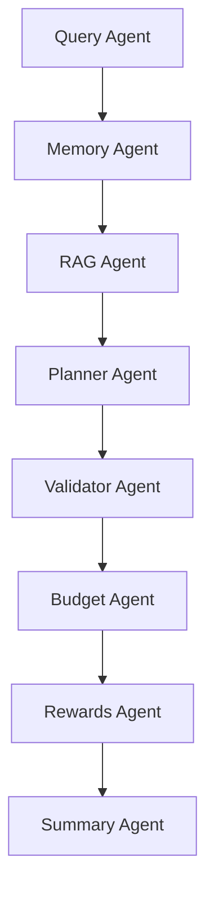

# Agent swarm Specification

This document details the role, target objectives, input/output schemas, and self-healing fallback mechanisms for each specialized agent in **MY_AI_TRAVELLER**.

---

## 1. Swarm Architecture

The platform uses a modular multi-agent orchestration architecture. Each agent is a specialized unit designed to solve a narrow problem. The orchestration is managed as a state graph where the agents act as nodes and communicate by updating the shared `TravelState`.



---

## 2. Agent Specifications

### 2.1 Query Agent
* **Role & Objective**: Parses raw natural language queries into a clean, structured JSON format containing traveler attributes.
* **Input**: Raw query string (e.g. `"Plan a 3-day Manali trip under 20k INR with my SBI Card."`).
* **Output Schema**:
  ```json
  {
    "destination": "Manali",
    "days": 3,
    "budget": 20000,
    "currency": "INR",
    "interests": ["scenic", "nature"],
    "cards": ["SBI"],
    "travel_pace": "moderate"
  }
  ```
* **Robust Fallback**: If the LLM call fails or returns non-JSON text, it routes to a local regex parser (`_fallback_parse` in `src/agents/query_agent.py`) that extracts duration numbers, destination match patterns, and budget values to merge with default config templates.

---

### 2.2 Memory Agent
* **Role & Objective**: Manages personalization and persistent preference traces.
* **Read Lifecycle**: Queries the user's ChromaDB preference collection (`user_behavioral_memory_v3`) for historical style preferences (dining style, pacing, walking tolerances) and compiles them.
* **Write Lifecycle**: Analyzes the finalized itinerary and feedback, extracts style metrics, scrubs specific destination names to prevent cross-destination pollution, and saves the sanitized preferences to ChromaDB.
* **Robust Fallback**: Yields default moderate preference settings if the collection is empty, the database is offline, or the user is anonymous.

---

### 2.3 RAG Agent
* **Role & Objective**: Contextual grounding engine. Retrieves tourist attractions, details, category tags, transport tips, and pricing matching the traveler's interests.
* **Input**: Destination name, traveler interests list.
* **Output**: A list of structured place dictionary objects containing geo-coordinates, recommended durations, and pricing.
* **Robust Fallback**: If ChromaDB fails or has connection timeouts, falls back to a memory-resident heuristic search over the pre-ingested local `src/rag_data/travel_data.json` database.

---

### 2.4 Planner Agent
* **Role & Objective**: Builds the daily itinerary grid (Morning, Afternoon, Evening slots) optimized for location-clustering (routing proximity) and pacing.
* **Input**: Grounded place entities (from RAG Agent), parsed query parameters, and retrieved memory style preferences.
* **Output**: JSON dictionary of daily slots.
* **Robust Fallback**: Uses a template builder to schedule RAG attractions chronologically, grouped by geographical clusters to minimize transit latency.

---

### 2.5 Validator Agent
* **Role & Objective**: Constraint auditor and self-healing planner. Enforces safety margins:
  1. **Grounding Check**: Ensures every scheduled landmark belongs to the target destination.
  2. **Duplicate Check**: Guarantees zero double-booking across all days.
  3. **Pacing / Template Audit**: Replaces generic template landmarks with authentic local attractions.
* **Uniqueness Safeguard**: If RAG resources run out of unique attraction names (common on long itineraries), it dynamically spawns unique sub-zones (e.g. `Senso-ji Temple (Area 2)`) to satisfy the uniqueness constraint.

---

### 2.6 Budget Agent
* **Role & Objective**: Cost modeling engineer. Predicts granular expenditure across Lodging, Dining, Transit, and Activities.
* **Input**: Generated itinerary grid and target budget limit.
* **Output**: Detailed pricing list and status (`within_budget` or `over_budget`).
* **Robust Fallback**: Uses simple category pricing multipliers based on target duration, hotel category flags, and food preferences.

---

### 2.7 Rewards Agent
* **Role & Objective**: Credit card rewards optimization engine. Matches merchant category codes (MCCs) to the traveler's card catalog.
* **Input**: Spend category list, list of user credit cards.
* **Output**: Recommended payment cards per transaction type (e.g., using co-branded airline cards for flight bookings, or cash-back cards for restaurants) and estimated discount percentages.

---

### 2.8 Refinement Agent
* **Role & Objective**: Surgical, day-locked replanner. Handles user modification feedback (e.g. `"I want to swap afternoon of Day 2 with a shopping spot"`).
* **Execution Pattern**: Extracts the targeted day index, locks all other days, alters only the targeted slot, and sends the revised plan through the Validator Agent.

---

### 2.9 Summary Agent
* **Role & Objective**: Formatting agent. Synthesizes the raw state JSON elements into a beautiful, recruiter-ready Markdown travel guide.
