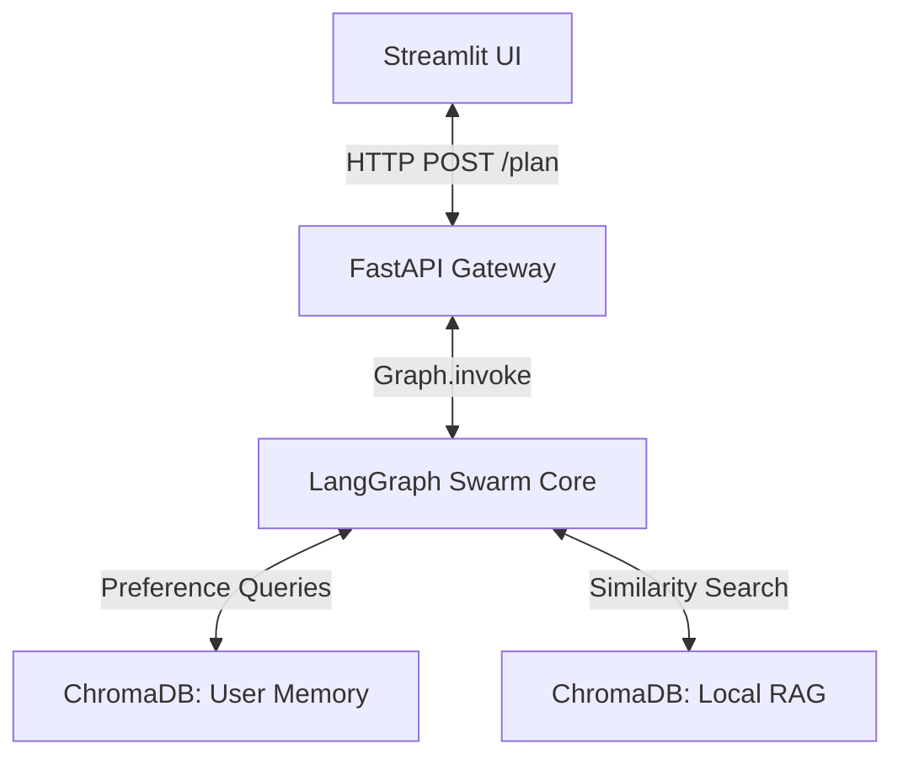
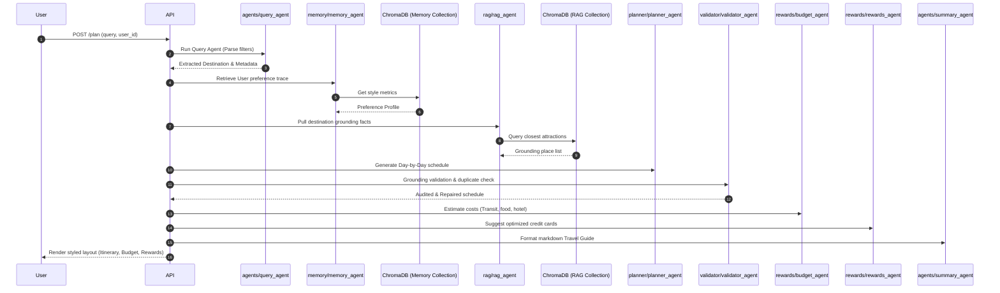

# System Architecture Specification

This document provides a comprehensive technical overview of **MY_AI_TRAVELLER**, a decoupled multi-agent travel orchestration platform. It describes the design patterns, storage layers, and state machines powering the real-time agent workflow.

---

## 1. High-Level Architecture

The platform follows a decoupled micro-orchestration design. A Streamlit frontend interacts with a FastAPI backend, which delegates work to a stategraph workflow managed by **LangGraph**.



### Components Summary

* **Frontend**: Responsive Single-Page SaaS dashboard developed with Streamlit, communicating with the FastAPI Gateway or invoking the graph directly in single-node mode.
* **API Gateway**: FastAPI layer exposing REST endpoints for plans generation, day-locked refinements, preference persistence, and user memory diagnostics.
* **Agent Swarm**: Modular Python packages organized under `src/` executing targeted tasks and modifying a central transaction state (`TravelState`).
* **Vector Store**: Single ChromaDB database partitioned into distinct collections for user preference memory and destination attraction knowledge base.

---

## 2. Multi-Agent Swarm Details

Each package in the repository represents a distinct concern:

```
src/
├── agents/      # Intent parsing (Query), Refinement, and Summarization
├── graph/       # State definition and LangGraph transition mapping
├── rag/         # Vector search knowledge retrieval and pre-ingestion scripts
├── memory/      # ChromaDB client, style extracting, location sanitizing
├── planner/     # Itinerary builders and scheduler heuristics
├── rewards/     # Budget modeling and Credit Card reward optimization
├── validator/   # Integrity loops, duplicate checks, and repairs
└── monitoring/  # Structured logging context and latency instrumentation
```

### Swarm Interaction Sequence



---

## 3. Storage Layer & Data Isolation

### ChromaDB Collections

1. **`user_behavioral_memory_v3`**:
   * Stores tenant style profiles (food preferences, pace, activity category).
   * **Data Isolation**: Multi-tenant separation is strictly enforced at the query level using `where={"user_id": user_id}`. Alice cannot read or write to Bob's partition.
   * **Sanitization**: Standardizer scripts scrub specific place names and destinations (e.g. replacing "cafes in Manali" with "cafes") before writing to disk, ensuring preference patterns can transfer to future trips without destination contamination.

2. **`travel_knowledge_base_v3`**:
   * Pre-ingested RAG vector collection containing travel documents, attraction descriptions, category tags, cost estimates, and recommended visiting times.

---

## 4. Design Decisions & Safety Controls

> [!NOTE]
> **Graceful Fallbacks**: Every agent is equipped with a functional deterministic fallback. If the LLM service undergoes rate limits (HTTP 429) or connection failures, the agent triggers fallback functions (e.g. using regex matching for Query parsing, or template-based selectors for the Planner) to maintain 100% platform availability.

> [!TIP]
> **Execution Instrumentation**: The `monitoring` module wraps each agent execution block using Python context managers, recording latency metrics, error status, token overhead, and trace IDs to `memory/app.log` for APM-like dashboard monitoring.
