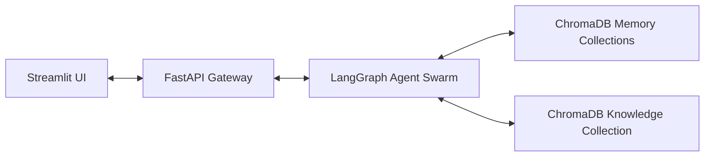
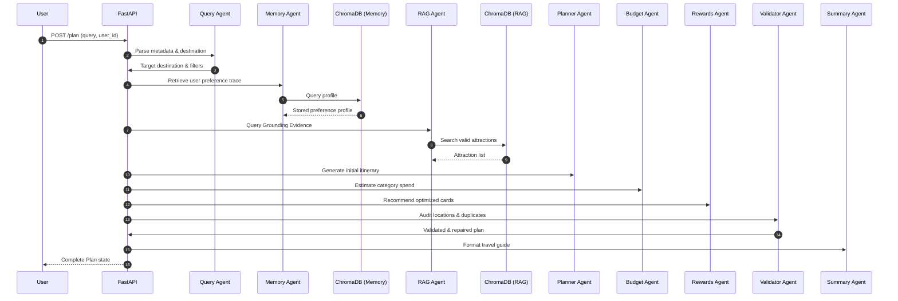
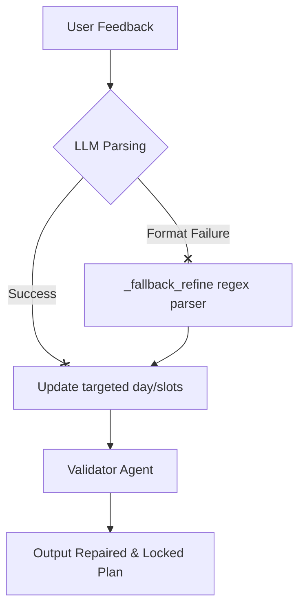

# System Architecture Specification

This document provides a detailed technical breakdown of the **my_travel_AI** platform's orchestration, agent graph, data flow, memory architecture, and API cycles.

---

## 1. Overall System Architecture
The platform is built as a decoupled, asynchronous multi-agent application:

---

## 2. Agent Responsibilities & Graph Orchestration
Orchestration is managed by a state graph built using **LangGraph**. The state is passed as a structured `TravelState` object.

### Agent Routing Lifecycle
1. **Query Agent**: Accepts the raw user input and outputs structured JSON metadata (budget, target days, destination, user cards, and interests).
2. **Memory Agent**: Queries the user's ChromaDB persistent preference store to retrieve historical styles.
3. **RAG Agent**: Queries local ChromaDB to pull valid attractions matching destination and user interests.
4. **Planner Agent**: Schedules morning, afternoon, and evening activities day-by-day.
5. **Budget Agent**: Models Lodging, Transit, and Activity costs.
6. **Rewards Agent**: Recommends optimized credit card usages.
7. **Validator Agent**: Audits constraints (hallucinations, leaks, duplicates) and repairs conflicts.
8. **Summary Agent**: Generates the final readable travel guide.

---

## 3. Planning Flow Sequence

---

## 4. Refinement Flow (Surgical Replanning)
When a user requests a change (e.g., swapping slots or editing a specific day):
1. The **Refinement Agent** parses the day index.
2. It locks other days to keep them byte-for-byte identical.
3. It mutates only the targeted slots or days.
4. The mutated plan is passed through the **Validator Agent** to ensure the new activities are valid for the target destination.

---

## 5. Memory Flow (Preference Extraction)
User preferences are updated incrementally:
1. The user finalized plan contains selected activity styles.
2. The **Memory Agent** extracts the styles (pacing, dining preference, activity style).
3. The agent filters out the target destination name to prevent location leaks.
4. The profile is saved back to ChromaDB under the user's specific partition ID.

---

## 6. API Endpoint Flow
* `GET /health` -> Simple availability check.
* `POST /plan` -> Executes the full LangGraph swarm pipeline.
* `POST /refine` -> Executes the surgical refinement pipeline.
* `POST /finalize` -> Triggers preference extraction and commits styles to persistent memory.
* `GET /memory/{user_id}` -> Fetches the active persistent style profile.
