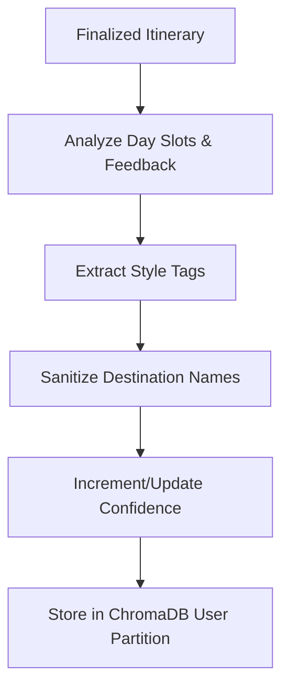

# Persistent Memory Specification

This manual explains the design, database schemas, partition separation, and location-sanitization routines of the user preference memory engine in **my_travel_AI**.

---

## 1. Memory Database Schema
User preferences are stored in a local **ChromaDB** database under the collection `user_behavioral_memory_v3`. 

Each preference document contains:
* **id**: `mem_{user_id}_{preference_type}`
* **document**: A natural language description of the preference (e.g., `"User prefers slow-paced travel with plenty of rest buffers."`).
* **metadata**:
  * `user_id`: Partition identifier.
  * `category`: Style category (`pace`, `food_style`, `activity_style`, `walking_tolerance`).
  * `confidence`: Integer score (0-100) indicating recommendation confidence.

---

## 2. Preference Extraction Lifecycle
During plan finalization, the **Memory Agent** reviews the generated plan and user feedback to extract style preferences:



---

## 3. Physical Location Sanitization
To prevent cross-destination style contamination (e.g., trying to suggest mountain viewpoints in a beach resort), the memory manager sanitizes all physical location markers before saving to disk.

### Implementation Logic
* Names of cities (e.g., `"Goa"`, `"Manali"`, `"Jaipur"`) and attraction names are parsed out of raw text.
* Stored records retain only destination-agnostic preference phrases (e.g., `"User prefers street food stalls and cafes"` instead of `"User likes cafes in Old Manali"`).

---

## 4. Multi-Tenant User Partitioning & Isolation
User partitions are isolated in ChromaDB by applying a query-level filter on `user_id`.

```python
results = collection.query(
    query_texts=["pace, food, activities"],
    where={"user_id": user_id},
    n_results=10
)
```

### Verification
The test suite validates memory isolation:
1. Plans an itinerary for Alice (`demo_alice`), who prefers cafes and slow pacing.
2. Plans an itinerary for Bob (`demo_bob`), who prefers adventure sports.
3. Verifies that Alice's memory partition contains zero mentions of Bob's styles (adventure sports) and vice versa, proving 100% tenant isolation.
