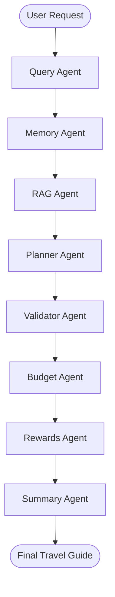
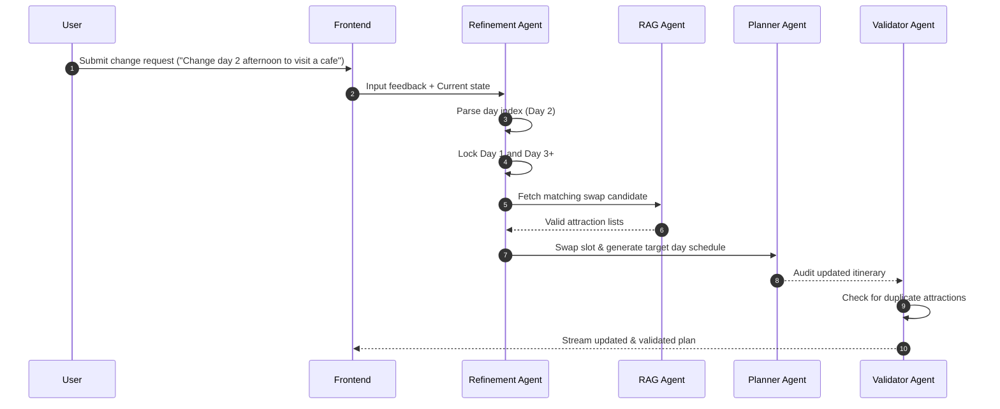

# Agent Orchestration Workflow

This document details the operational workflow of **MY_AI_TRAVELLER**, illustrating how the multi-agent swarm operates, manages state transitions, retrieves knowledge from vector stores, validates constraint criteria, and executes surgical plan updates.

---

## 1. Swarm State Structure

The swarm leverages a shared, mutable `TravelState` dictionary built with **LangGraph** to coordinate context across nodes. This state ensures strong typing and strict interface contracts between agent layers:

```python
class TravelState(TypedDict):
    user_id: str                      # Unique tenant identifier
    raw_query: str                    # Original natural language user prompt
    destination: str                  # Standardized target destination
    structured_query: dict            # Extracted query attributes (days, budget, interests)
    rag_context: str                  # Consolidated RAG attraction context
    rag_documents: list[dict]          # Grounding evidence documents
    allowed_places: list[str]          # Valid attraction names for the target destination
    allowed_place_entities: list[dict] # Full dictionaries of the allowed attractions
    itinerary_json: dict              # Raw scheduled days (JSON schema)
    itinerary: str                    # Markdown rendering of the raw itinerary
    refined_itinerary_json: dict      # Mutated schedule days after surgical refinement
    refined_itinerary: str            # Markdown rendering of the refined plan
    budget: dict                      # Total cost breakdown modeled by Budget Agent
    rewards: dict                     # Payment optimization recommended by Rewards Agent
    summary: str                      # Final compiled user-facing travel guide
    user_feedback: Optional[str]      # Surgical edit feedback string
    memory_context: str               # String context representing retrieved preferences
    behavior_profile: dict            # Current user's behavioral preference parameters
    session_memory: dict              # State memory trace for current session
    validation_report: dict           # Quality report emitted by Validator Agent
    modification_intent: dict         # Extracted day-locked modification details
    changed_days: list[int]           # Targeted days for refinement
    stored_memories: list[dict]       # List of preferences committed to ChromaDB
    status: str                       # Execution state flag
    agent_metrics: dict               # Latency and API cost metrics
```

---

## 2. Core Execution Pipeline

The core execution path is modeled as a directed acyclic graph (DAG) where nodes represent individual specialized agents. 

### Swarm Topology


### Flow Step Description

| Step | Agent / Node | Role & Objective | Transition Action |
|---|---|---|---|
| 1 | **Query Agent** | Parse intent & standardize location. | Extracts destination, duration, card names, and preferences. Standardizes destination (e.g. `Bangkok`, `Manali`, `Paris`, `Tokyo`). |
| 2 | **Memory Agent** | Retrieve tenant preference profile. | Queries ChromaDB for historic styles of `user_id`, injecting preferences into `memory_context`. |
| 3 | **RAG Agent** | Retrieve localized travel knowledge. | Queries ChromaDB's attraction vector store to retrieve place entities, pricing, and timing. |
| 4 | **Planner Agent** | Draft day-by-day itineraries. | Synthesizes target slots (Morning, Afternoon, Evening) matching interests and memory. |
| 5 | **Validator Agent** | Integrity and unique attractions check. | Scans for duplicates, incorrect destination cities, and pacing rules. Corrects plan automatically. |
| 6 | **Budget Agent** | Model lodging, transit, and food costs. | Categorizes costs to determine if plan is within requested budget. |
| 7 | **Rewards Agent** | Optimize credit card category usage. | Computes credit card rewards rules and provides card suggestions. |
| 8 | **Summary Agent** | Compile the finalized narrative. | Synthesizes itinerary, budget, and cards into a highly styled travel guide. |

---

## 3. The Refinement Cycle (Day-Locked Replanning)

A unique capability of **MY_AI_TRAVELLER** is its **Surgical Refinement** module. When a user requests adjustments to an itinerary:
1. The **Refinement Agent** parses the day index and intent.
2. It locks the remaining days byte-for-byte.
3. It regenerates plans only for the target slots on the specified days.
4. The **Validator Agent** inspects the modified day to prevent duplicate attractions or destination leakage.

### Day-Locked State Machine


> [!IMPORTANT]
> **Constraint Enforcement**: Swaps are only allowed if the new attraction does not violate target constraints (budget, location grounding, or unique visits). If a duplicate is detected, the Validator swaps it with a high-relevance alternative from the RAG store.
